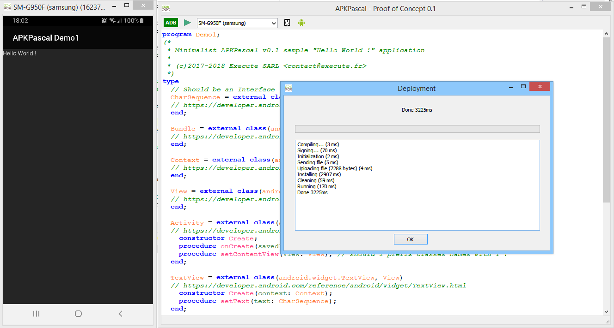

# APKPascal demo1

to build an APK from a Pascal code, I had to define some new features in the language like I did for [FlashPascal](http://flashpascal.execute.re).

APKPascal knows very few things about the Android framework, so, like you have a Winapi.Windows unit in Delphi to define the Win32 API, APKPascal needs some declarations about the framework.

```Pascal
type
  Activity = external class(android.app.Activity, Context)
  // https://developer.android.com/reference/android/app/Activity.html
    constructor Create;
    procedure onCreate(savedInstanceState: Bundle); virtual;
    procedure setContentView(view: View); // should I prefix classes with T ?
  end;
	
  // user defined Activity
  minimal = class(Activity)
    procedure onCreate(savedInstanceState: Bundle); override;
  end;
````

An `external class` is a direct reference to a "Java" class, like [android.app.Activite](https://developer.android.com/reference/android/app/Activity.html). The declaration do not need to be complet, and as you can see, APKPascal allows a parameter name to be equal to the type name (View).

An Android application use a Manifest file to define the "MAIN" activity, for now, APKPascal expect a class instentiation in the main code of the application, this can change in the futur.

```Pascal
begin
// could be a {$MAIN_ACTIVITY minimal} directive, or a [MAIN] attribut...
  minimal.Create();
end.
````

