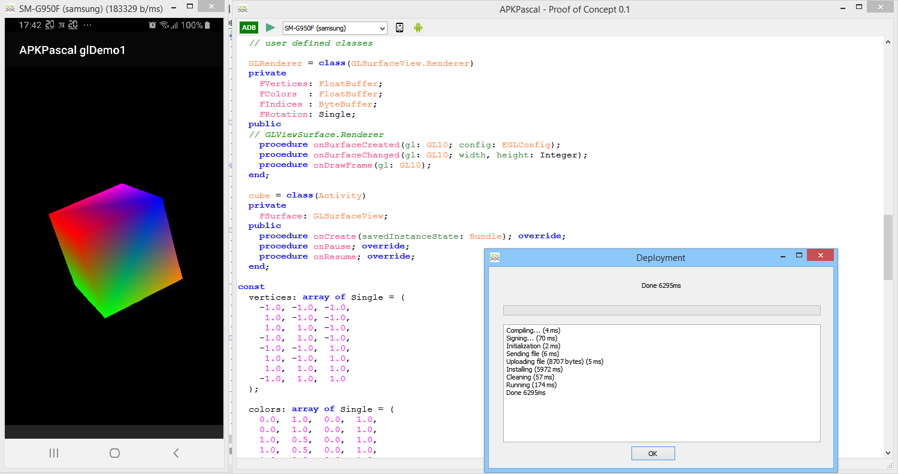

# APKPascal glDemo1

after the [demo1](../demo1) I wanted something nicer for the second demo of APKPascal.

the code is a simple 3D rotating OpenGL cube, it's not complex from the code point of view, but it has required a lot of work on the compiler side.

1. this code define some globals array of data that needs to be initialized.
2. the GLRenderer class implements an inner Interface of GLSurfaceView
3. `GLU.gluPerspective` is a static class method
5. `GL10` contains constant values (those values could have been imported by the code, but actualy they are local constants)

an invisible part of the job was on the DEX format, because this application produce much more code that the first one and lead to miss alignment, wrong referenced and a lot of other nasty things. dexdump helped me a lot for that.

